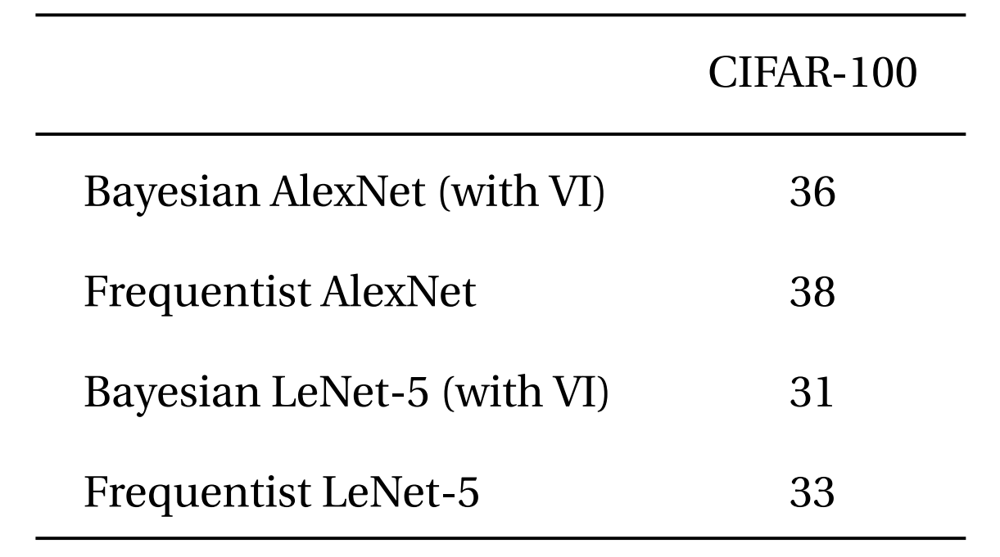
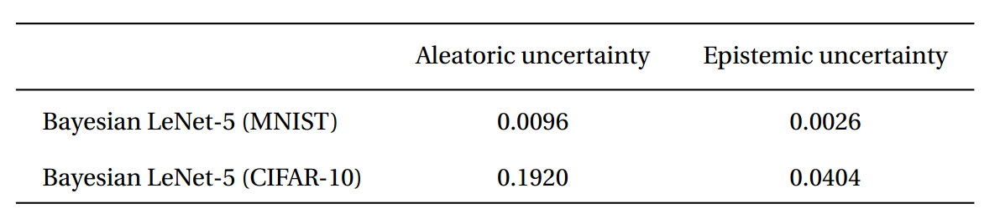

# Bayesian CNN with Variational Inference for Image Recognition task

We introduce **Bayesian convolutional neural networks with variational inference**, a variant of convolutional neural networks (CNNs), in which the intractable posterior probability distributions over weights are inferred by **Bayes by Backprop**. We demonstrate how our proposed variational inference method achieves performances equivalent to frequentist inference in identical architectures on several datasets (MNIST, CIFAR10, CIFAR100), while the two desiderata, a measure for uncertainty and regularization are incorporated naturally. We examine in detail how this measure for uncertainty, namely the predictive variance, can be decomposed into aleatoric and epistemic uncertainties. 

---------------------------------------------------------------------------------------------------------

### Directory Structure:
`layers/`:  Contains ModuleWrapper, FlattenLayer, Bayesian layers (BBBConv2d and BBBLinear).  
`models/BayesianModels/`: Contains standard Bayesian models (BBBLeNet, BBBAlexNet).  
`models/NonBayesianModels/`: Contains standard Non-Bayesian models (LeNet, AlexNet).  
`checkpoints/`: Here your models will be stored.  
`tests/`: Contains some basic unittests for layers and models.  
`main_bayesian.py`: Contains actual procedure of training and evaluating bayesian models.  
`config_bayesian.py`: Contains Hyperparameters for `main_bayesian`.  
`main_frequentist.py`: Contains actual procedure of training and evaluating non-bayesian models.  
`config_frequentist.py`: Contains Hyperparameters for `main_frequentist`. 

### How to perform standard experiments?
Currently, following datasets and models are supported.  
Datasets: MNIST, CIFAR10, CIFAR100  
Models: AlexNet, LeNet, 3conv3fc  

In order to start experiment, set hyperparameters in `config_bayesian.py` or `config_frequentist.py` and run `main_bayesian.py` or `main_frequentist.py` accordingly.  

### How to make a custom model?
To make a custom model, you just need to inherit `layers.misc.ModuleWrapper` instead of `torch.nn.Module` and use `layers.BBBLinear.BBBLinear` and `layers.BBBConv.BBBConv2d` instead of `torch.nn.Conv2d` and `torch.nn.Linear`. Moreover, you don't need to define `forward` method. It'll be automatically be taken care of.  
For example:  
```python
class Net(nn.Module):

  def __init__(self):
    super().__init__()
    self.conv = nn.Conv2d(3, 16, 5, strides=2)
    self.bn = nn.BatchNorm2d(16)
    self.relu = nn.ReLU()
    self.fc = nn.Linear(800, 10)

  def forward(self, x):
    x = self.conv(x)
    x = self.bn(x)
    x = self.relu(x)
    x = x.view(-1, 800)
    x = self.fc(x)
    return x
```
An example of model given above can be converted to Bayesian as follows:
```python
class Net(ModuleWrapper):

  def __init__(self):
    super().__init__()
    self.conv = BBBConv2d(3, 16, 5, strides=2, alpha_shape=(1,1))
    self.bn = nn.BatchNorm2d(16)
    self.relu = nn.ReLU()
    self.flatten = FlattenLayer(800)
    self.fc = BBBLinear(800, 10, alpha_shape=(1,1))
```
**Note:** You need to add FlattenLayer after convolutional block. `forward` method of the model will return tuple `(logits, kl)`.


### Filter weight distributions in a Bayesian Vs Frequentist approach


---------------------------------------------------------------------------------------------------------

### Fully Bayesian perspective of an entire CNN 


---------------------------------------------------------------------------------------------------------

## Results 

### Results on MNIST and CIFAR 10 dataset


---------------------------------------------------------------------------------------------------------


### Results on CIFAR100 dataset




--------------------------------------------------------------------------------------------------------

### Uncertainty Estimation




If you are using this work, please cite:

```
@article{shridhar2018bayesian,
  title={Bayesian Convolutional Neural Networks with Variational Inference},
  author={Shridhar, Kumar and Laumann, Felix and Llopart Maurin, Adrian and Olsen, Martin and Liwicki, Marcus},
  journal={arXiv preprint arXiv:1806.05978},
  year={2018}
}
```

--------------------------------------------------------------------------------------------------------