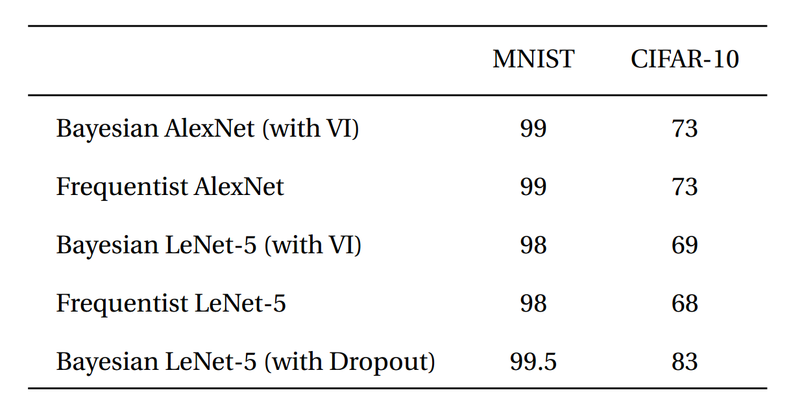

# Bayesian CNN with Variational Inference for Image Recognition task

We introduce **Bayesian convolutional neural networks with variational inference**, a variant of convolutional neural networks (CNNs), in which the intractable posterior probability distributions over weights are inferred by **Bayes by Backprop**. We demonstrate how our proposed variational inference method achieves performances equivalent to frequentist inference in identical architectures on several datasets (MNIST, CIFAR10, CIFAR100), while the two desiderata, a measure for uncertainty and regularization are incorporated naturally. We examine in detail how this measure for uncertainty, namely the predictive variance, can be decomposed into aleatoric and epistemic uncertainties. 

---------------------------------------------------------------------------------------------------------


### Filter weight distributions in a Bayesian Vs Frequentist approach


---------------------------------------------------------------------------------------------------------

### Fully Bayesian perspective of an entire CNN 


---------------------------------------------------------------------------------------------------------

## Results 

### Results on MNIST and CIFAR 10 dataset




---------------------------------------------------------------------------------------------------------


### Results on CIFAR100 dataset


--------------------------------------------------------------------------------------------------------

### Uncertainty Estimation


If you are using this work, please cite:

```
@article{shridhar2018bayesian,
  title={Bayesian Convolutional Neural Networks with Variational Inference},
  author={Shridhar, Kumar and Laumann, Felix and Llopart Maurin, Adrian and Olsen, Martin and Liwicki, Marcus},
  journal={arXiv preprint arXiv:1806.05978},
  year={2018}
}
```

--------------------------------------------------------------------------------------------------------