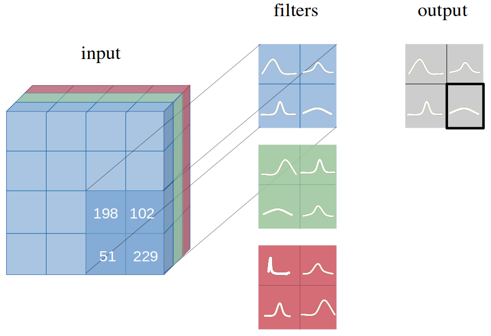
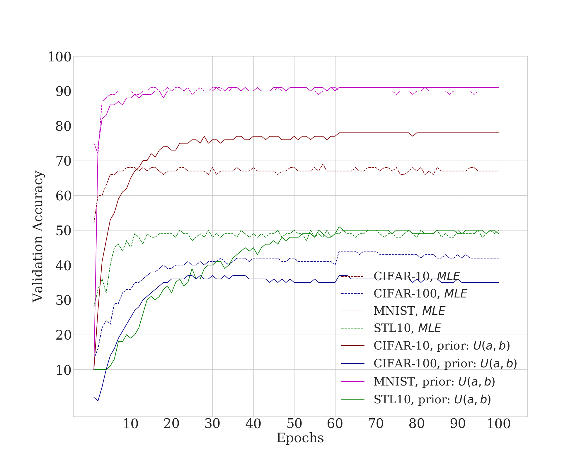

# Bayesian CNN

Implementation of [Bayes by Backprop](https://arxiv.org/abs/1505.05424) in a convolutional neural network.

### One convolutional layer with distributions over weights in each filter



### Fully Bayesian perspective of an entire CNN 


### Results 
#### Results on MNIST, CIFAR-10 and CIFAR-100 with 3Conv3FC 



If you are using this work, please cite the authors:
```
@ARTICLE{2018arXiv180605978S,
   author = {{Shridhar}, K. and {Laumann}, F. and {Llopart Maurin}, A. and 
	{Liwicki}, M.},
    title = "{Bayesian Convolutional Neural Networks}",
  journal = {ArXiv e-prints},
archivePrefix = "arXiv",
   eprint = {1806.05978},
 keywords = {Computer Science - Machine Learning, Computer Science - Computer Vision and Pattern Recognition, Computer Science - Neural and Evolutionary Computing, Statistics - Machine Learning},
     year = 2018,
    month = jun,
   adsurl = {http://adsabs.harvard.edu/abs/2018arXiv180605978S},
  adsnote = {Provided by the SAO/NASA Astrophysics Data System}
}
```
