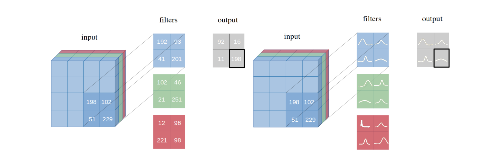
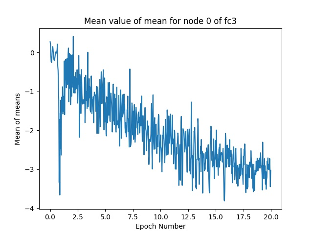
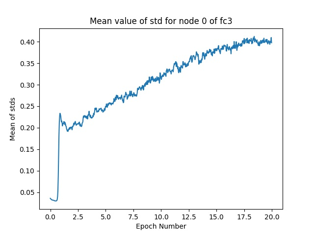

# Bayesian CNN with Variational Inference

[](https://www.python.org/downloads/release/python-376/)
[](https://pytorch.org/)
[](https://github.com/kumar-shridhar/PyTorch-BayesianCNN/blob/master/LICENSE)
[](https://arxiv.org/abs/1901.02731)

We introduce **Bayesian convolutional neural networks with variational inference**, a variant of convolutional neural networks (CNNs), in which the intractable posterior probability distributions over weights are inferred by **Bayes by Backprop**. We demonstrate how our proposed variational inference method achieves performances equivalent to frequentist inference in identical architectures on several datasets (MNIST, CIFAR10, CIFAR100) as described in the [paper](https://arxiv.org/abs/1901.02731).

---------------------------------------------------------------------------------------------------------


### Filter weight distributions in a Bayesian Vs Frequentist approach



---------------------------------------------------------------------------------------------------------

### Fully Bayesian perspective of an entire CNN 


---------------------------------------------------------------------------------------------------------


### Make your custom Bayesian Network?
To make a custom Bayesian Network, inherit `layers.misc.ModuleWrapper` instead of `torch.nn.Module` and use `layers.BBBLinear.BBBLinear` and `layers.BBBConv.BBBConv2d` instead of `torch.nn.Conv2d` and `torch.nn.Linear`. Moreover, no need to define `forward` method. It'll automatically be taken care of. 

For example:  
```python
class Net(nn.Module):

  def __init__(self):
    super().__init__()
    self.conv = nn.Conv2d(3, 16, 5, strides=2)
    self.bn = nn.BatchNorm2d(16)
    self.relu = nn.ReLU()
    self.fc = nn.Linear(800, 10)

  def forward(self, x):
    x = self.conv(x)
    x = self.bn(x)
    x = self.relu(x)
    x = x.view(-1, 800)
    x = self.fc(x)
    return x
```
Above Network can be converted to Bayesian as follows:
```python
class Net(ModuleWrapper):

  def __init__(self):
    super().__init__()
    self.conv = BBBConv2d(3, 16, 5, strides=2, alpha_shape=(1,1), name='conv')
    self.bn = nn.BatchNorm2d(16)
    self.relu = nn.ReLU()
    self.flatten = FlattenLayer(800)
    self.fc = BBBLinear(800, 10, alpha_shape=(1,1), name='fc')
```

#### Notes: 
1. Add `FlattenLayer` before first `BBBLinear` block.  
2. `forward` method of the model will return a tuple as `(logits, kl)`.
3. Keyword argument `name` is optional and is required to use only when recording mean and variances in turned ON.

---------------------------------------------------------------------------------------------------------

### How to perform standard experiments?
Currently, following datasets and models are supported.  
* Datasets: MNIST, CIFAR10, CIFAR100  
* Models: AlexNet, LeNet, 3Conv3FC  

#### Bayesian

`python main_bayesian.py`
  * set hyperparameters in `config_bayesian.py`


#### Frequentist

`python main_frequentist.py`
  * set hyperparameters in `config_frequentist.py`

---------------------------------------------------------------------------------------------------------


### Recording Mean and Variance:
If `record_mean_var` is `True`, then mean and variances for layers in `record_layers` list will be logged in checkpoints directory. Recording frequency per epoch can be defined. All these mentioned parameters can be modified in the `config_bayesian.py` file.  

#### DistPlots


#### LinePlots



#### Notes:
1. The recording will only take place during the training phase of the model.  
2. Choose `recording_freq_per_epoch` as a multiple of number of training iterations. It's not necessary but this will record exactly that many times.  
   Example: for `num_iteration = 96`, `recording_freq_per_epoch = 48`. Therefore, `step_size` will be 2 and will record exactly 48 times.  
   But for `num_iteration = 96`, `recording_freq_per_epoch = 49`. Therefore, `step_size` will be 1 and will record 96 times.  
3. Choosing `recording_freq_per_epoch` higher than number of training iterations will raise `ZeroDivisionError`.

In order to visualize the recorded values, `visualize_mean_var.py` contains `draw_distributions` and `draw_lineplot` methods. Following are the arguments which needs to be passed to `visualize_mean_var.py`:  
  * `--filename`: Path to log file.
  * `--data_type`: Draw plots for what? `mean`, `std` or `both`? Default is `'mean'`.  
  * `--node_no`: Index of the node for which to draw plots. Index is after flattening of the layer. Default is 0 i.e, first node.
  * `--plot_type`: Which plot to draw? Currently we support lineplot and distplot. Default is `'lineplot'`.
  * `--plot_time`: Pauses the plot for this much amount of time before updating it. Default is 1 second.
  * `--save_plots`: Whether to save plots or not. Default is 0 for No. 1 is for Yes.
  * `--save_dir`: Directory for saving plots. Must end with `'/'`. If not provided, default directory will be `filename_directory/plots/`.

---------------------------------------------------------------------------------------------------------

### Directory Structure:
`layers/`:  Contains ModuleWrapper, FlattenLayer, Bayesian layers (BBBConv2d and BBBLinear).  
`models/BayesianModels/`: Contains standard Bayesian models (BBBLeNet, BBBAlexNet, BBB3Conv3FC).  
`models/NonBayesianModels/`: Contains standard Non-Bayesian models (LeNet, AlexNet).  
`checkpoints/`: Checkpoint directory for the best model will be saved here.  
`tests/`: Basic unittest cases for layers and models.  
`main_bayesian.py`: Train and Evaluate Bayesian models.  
`config_bayesian.py`: Hyperparameters for `main_bayesian` file.  
`main_frequentist.py`: Train and Evaluate non-Bayesian (Frequentist) models.  
`config_frequentist.py`: Hyperparameters for `main_frequentist` file.  
`visualize_mean_var.py`: Plotting Distributions and Line graphs of mean and variances.

---------------------------------------------------------------------------------------------------------


If you are using this work, please cite the authors:

```
@article{shridhar2019comprehensive,
  title={A comprehensive guide to bayesian convolutional neural network with variational inference},
  author={Shridhar, Kumar and Laumann, Felix and Liwicki, Marcus},
  journal={arXiv preprint arXiv:1901.02731},
  year={2019}
}
```

--------------------------------------------------------------------------------------------------------
